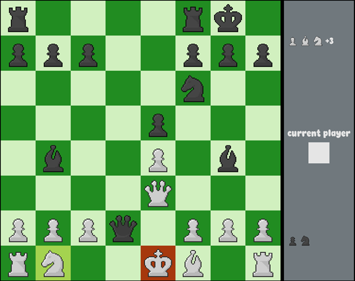

# Chess

### Chess game with OpenGL

The pieces are drawn in pixel art.
A piece's possible moves are highlighted with a dark gray circle. All chess rules are implemented along with win/draw detection.

  

#### Requirements
* OpenGL
* GLM 0.9.9.8
* GLFW3
* stb_image
* glad
* freetype
* gtest (optional)
